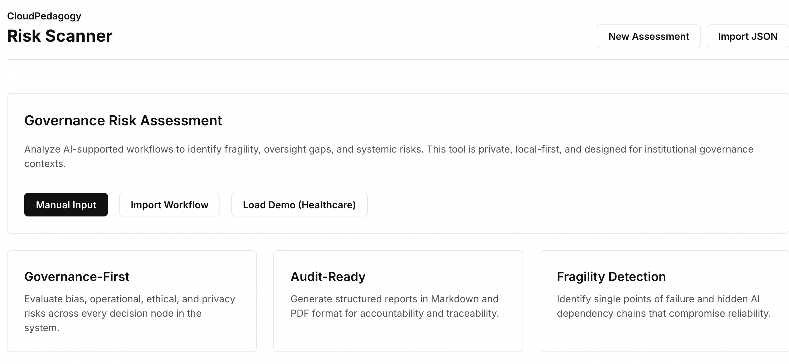

# CloudPedagogy AI Governance Risk Scanner

A governance-first analysis tool for identifying risk, fragility, and oversight gaps in AI-supported workflows and decision systems.

## 🔗 Role in the CloudPedagogy Ecosystem

**Phase:** Phase 2 — Governance Pipeline

**Role:**
Performs authoritative, independent audits of AI-supported workflows to identify fragility, risk concentrations, and oversight gaps.

**Upstream Inputs:**
Structured workflow definitions from the **Workflow Governance Designer** or manual user input.

**Downstream Outputs:**
Generates risk profiles and remediation flags for the **Human-AI Decision Record** and **Governance Maturity Assessment**.

**Does NOT:**
- Act as a design environment for new workflows.
- Record live individual decision outcomes in production.

For a full system overview, see: [SYSTEM_OVERVIEW.md](../SYSTEM_OVERVIEW.md)

---

## 🚀 Overview

The **CloudPedagogy AI Governance Risk Scanner** is a static, browser-based application designed to analyse AI-supported workflows and decisions through a governance lens.

It helps organisations:

- identify hidden risks and failure points  
- detect missing oversight and accountability structures  
- understand AI dependency and system fragility  
- generate structured, governance-ready risk reports  

The tool is built using **Capability-Driven Development (CDD)**, ensuring that risk awareness, accountability, traceability, and reviewability are embedded directly into the design.

---

## 🧭 Position within CloudPedagogy

This tool is part of the **Human–AI Governance Engineering suite**.

It operates at the **workflow and system level**, complementing:

- **Human–AI Decision Record Tool** → documents individual decisions  
- **AI Workflow Governance Designer** → designs AI-supported workflows  
- **AI Governance Risk Scanner (this tool)** → analyses risk, fragility, and oversight gaps  

Together, these tools support a structured governance stack:

Decision → Workflow → Risk → Capability

---

## 🧩 Key Features

- **Flexible Input Mode**  
  Define workflows manually or import structured JSON from related CloudPedagogy tools  

- **Risk Assessment Engine**  
  Evaluate Bias, Operational, Ethical, Governance, and Privacy risks across workflow steps  

- **Failure Mode Analysis**  
  Identify breakdown points, cascading impacts, and system fragility  

- **Oversight Gap Detection**  
  Flag missing human review, unclear accountability, and weak governance structures  

- **AI Dependency Analysis**  
  Assess the level and concentration of AI reliance across the workflow  

- **Authoritative Risk Scoring**  
  Calculate **Inherent Risk** (Severity × Likelihood) and **Residual Risk** using institutional mitigation multipliers (None to Robust).  

- **Critical Path Analysis**  
  Identify structural vulnerabilities such as high-risk clusters, single points of failure, and systemic fragility.

- **Mitigation Effectiveness Mapping**  
  Score control strength on a 1–5 scale to determine the practical reduction in operational risk.

- **Governance-Ready Exports**  
  Generate structured audit reports as JSON or Markdown, optimized for institutional governance review.

---

## ⚙️ Input Schema / Expected JSON Structure

The Risk Scanner is designed for high-fidelity interoperability with the **AI Workflow Governance Designer**. It identifies and ingestion steps and AI metadata to automate the baseline audit setup.

### Expected JSON Format
```json
{
  "metadata": {
    "workflow_id": "WF-2026-X",
    "workflow_title": "Automated Admissions Review"
  },
  "steps": [
    {
      "step_id": "step-1",
      "step_name": "Initial Screening",
      "ai_involved": true
    }
  ]
}
```

### Independent Audit Principle
The Risk Scanner performs an **authoritative, independent audit**. 
- It may explicitly **ignore upstream design-time metrics** (e.g., `design_time_metrics` or pre-calculated design scores).
- This is an intentional governance constraint to ensure the audit remains objective, fresh, and uninfluenced by design-phase assumptions.

---

## 🌐 Live Hosted Version

Access the live tool:

http://cloudpedagogy-ai-governance-risk-scanner.s3-website.eu-west-2.amazonaws.com/

---

## 🖼️ Screenshot



---
## 🛠️ Getting Started

### Clone the repository

```bash
git clone [repository-url]
cd [repository-folder]
```

### Install dependencies

```bash
npm install
```

### Run locally

```bash
npm run dev
```

Once running, your terminal will display a local URL (often http://localhost:5173). Open this in your browser to use the application.

### Build for production

```bash
npm run build
```

The production build will be generated in the `dist/` directory and can be deployed to any static hosting service.

---

## 🔐 Privacy & Security

- **Fully local**: All data remains in the user's browser  
- **No backend**: No external API calls or database storage  
- **Privacy-preserving**: No tracking or data exfiltration  
- Suitable for use in sensitive organisational and governance contexts  

---

## ⚙️ Capability-Driven Development (CDD)

This application is designed using **Capability-Driven Development (CDD)**.

CDD ensures that governance requirements shape the system from the outset, rather than being added retrospectively.

In this tool, CDD is reflected through:

- explicit risk categorisation across multiple domains  
- structured oversight and accountability checks  
- failure mode and fragility analysis  
- traceability through structured outputs  
- support for review, audit, and reflective improvement  

---

## Disclaimer

This repository contains exploratory, framework-aligned tools developed for reflection, learning, and discussion.

These tools are provided **as-is** and are not production systems, audits, or compliance instruments. Outputs are indicative only and should be interpreted in context using professional judgement.

All applications are designed to run locally in the browser. No user data is collected, stored, or transmitted.

All example data and structures are synthetic and do not represent any real institution, programme, or curriculum.

---

## Licensing & Scope

This repository contains open-source software released under the MIT License.

CloudPedagogy frameworks and related materials are licensed separately and are not embedded or enforced within this software.

---

## About CloudPedagogy

CloudPedagogy develops open, governance-credible resources for building confident, responsible AI capability across education, research, and public service.

- Website: https://www.cloudpedagogy.com/
- Framework: https://github.com/cloudpedagogy/cloudpedagogy-ai-capability-framework
